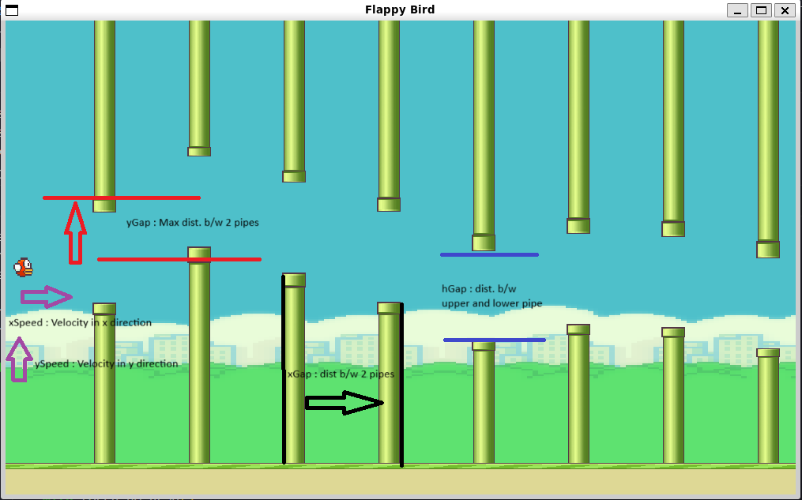

# Flappy Bird RL

## Table of Contents
- [Demo](#demo)
- [Setup](#setup)
  - [Creating Conda Environment](#creating-conda-environment)
  - [Installing Requirements](#installing-requirements)
- [Running the Project](#running-the-project)
- [Usage](#usage)
- [Program Flow](#program-flow)
- [To Do](#to-do)
- [Credits](#credits)

## Demo

<video src='https://github.com/user-attachments/assets/92d79e54-8abc-4abb-8abc-794c4a425771.mov' width=180/>

## Setup
Creating conda environment
```bash
$ conda create -n dqn python=3.11
$ conda activate dqn
```

## Installing requirements
```bash
$ pip install -r requirements.txt
```

## Running the Project
Starting Simulation Server
```bash
$ python server.py
```
You are now ready to use the dqn.ipynb

## Usage
### Testing Model
- Run all cells up till **Training**
- Pre-Trained model is available in `models/0`
- You can change `test_env_config` to change simulation env
- For longer simulation update max_score (default 100)

### Training Model
- Run all cells till **Testing**
- Training loop gradually increases toughness (`NUM_EPS` steps)
- Starting Env Config can be modified in `env_config`
- Ending Env Config can be modified in `env_config_final`
- The default training setup takes about 90 min to run

### Environment Params


### Simulation on Diff PC
- Helpful for people colab users
- Run `server.py` in your local pc
- Port Forward `port : 5000` & Modify `server_ip` & `server_port` in `Proxy`

## Program Flow
- `server.py` : 
  - Waits for Incoming Requests
  - When a Request comes, it hands it's over `manager`

- `manager.py` :
  - Decodes Messages from Client
  - Brings in Necessary Changes to `Simulator`

- `server`,`manager`,`Simulator` are all on server side

- `proxy.py` :
  - The notebook need not see the underlying implementation
  - For the notebook, `proxy` is the simulation environment
  - This file abstracts sockets, message formats,... etc

- `connect.py`
  - Has Custom implementation of blocking sends & recvs

- `simulator.py` 
  - Does all the simulation logic (math) & updates `GUI`

- `gui.py`
  - Abstracts all the pygame gui logic
  - Just blindly updates whatever `Simulator` says

## To do
- Small Bug Fix in `DQN.ipynb`
- Animate Bird Flapping Wings
- Plots for Reward Visualization
- Try out Dueling DQNs & Actor Critic Networks

## Credits
Assets from : https://github.com/zhaolingzhi/FlapPyBird-master
